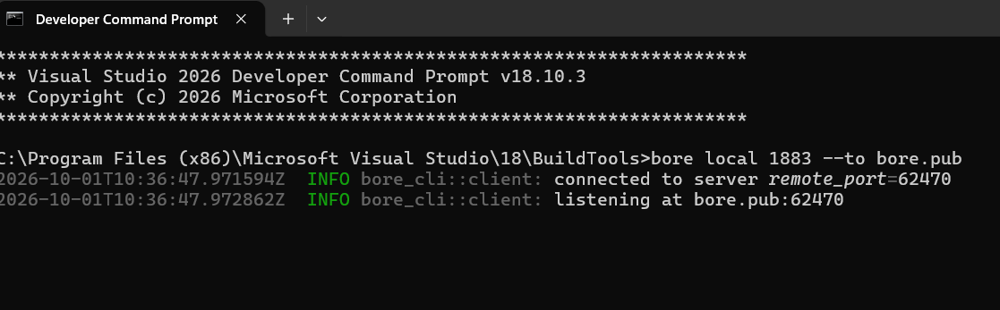
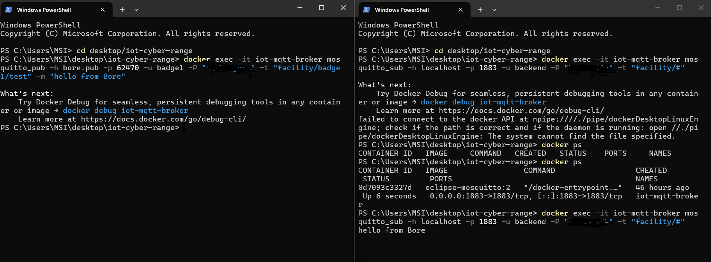
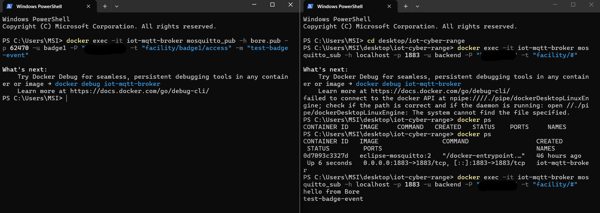
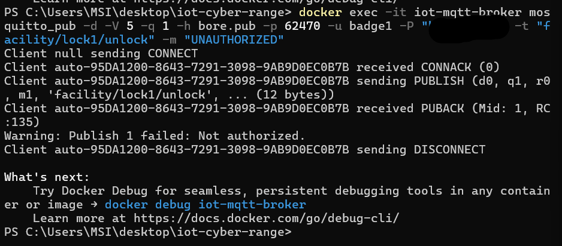
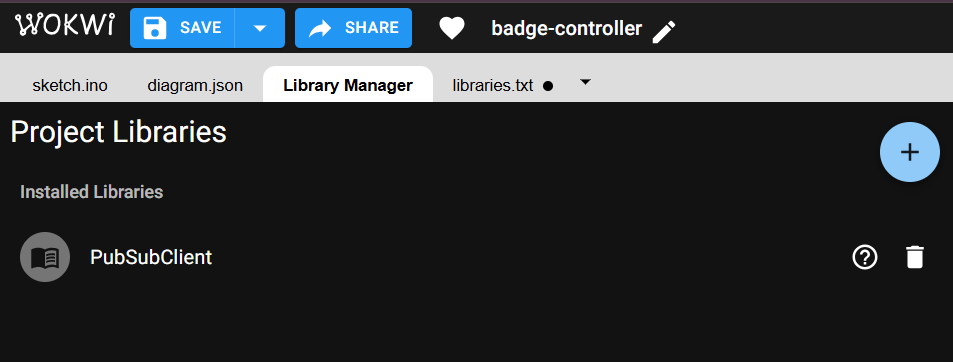
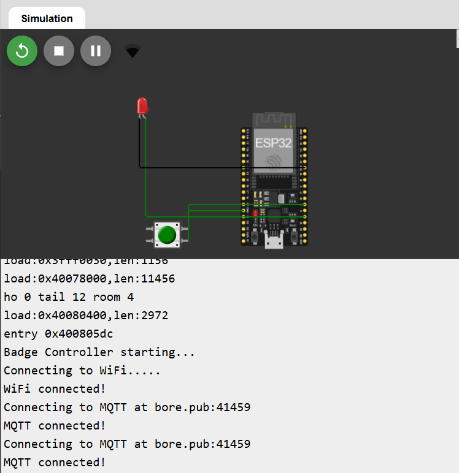
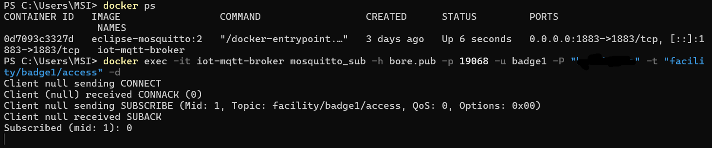
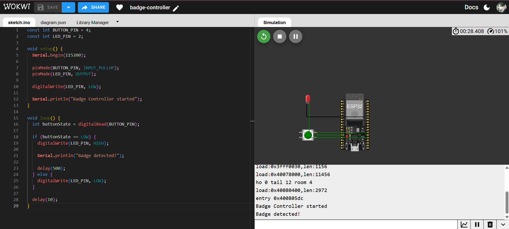
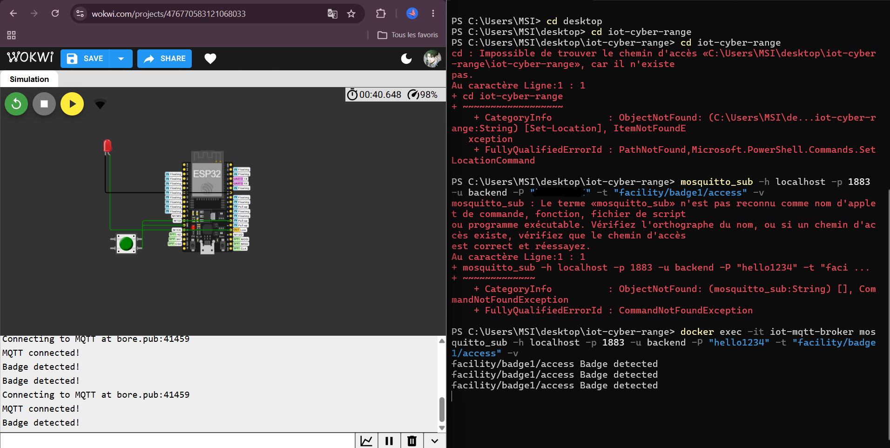

# Build Log — IoT Cyber Range

This file tracks every development step chronologically, with screenshots
as evidence, stored in `screenshots/`.

---

## Step 1: Repository structure

**What was done:**
Created the base repo structure to organize the project from day one:

iot-cyber-range/
esp32/
badge-controller/
motion-sensor/
lock-actuator/
Broker/
Backend/
screenshots/
docker-compose.yml
README.md
Notes.md

*Figure 1 — IoT Cyber Range project structure*

**Next:** write `mosquitto.conf` and `acl.conf`.

---

## Step 1 (cont.): Mosquitto broker configuration

**What was done:**
Wrote `Broker/mosquitto.conf`:
- Listener on port `1883`
- Protocol: `mqtt`
- References `acl.conf` for access control
- `allow_anonymous true` — set temporarily for development, flagged in
  Known Issues below for hardening before the final demo

*Figure 2 — Mosquitto MQTT broker configuration*

**Next:** write the ACL rules.

---

## Step 2: MQTT access control (ACL)

**What was done:**
Wrote `Broker/acl.conf` defining per-device permissions:
- `badge-controller` (ESP32 #1): publish-only on `facility/badge1/#`
- `motion-sensor` (ESP32 #2): publish-only on `facility/zone2/#`
- `lock-actuator` (ESP32 #3): subscribe-only on `facility/lock3/cmd`
- `backend`: subscribe-only on `facility/#` (wildcard, read-only)

*Figure 3 — MQTT access control rules*

**Note:** these rules were written but not yet fully enforceable with
confidence at this point, since `allow_anonymous true` was still active in
the broker config — see Known Issues (now resolved, see Step 4 cont. below).

**Next:** add Mosquitto as a service in `docker-compose.yml` and test it.

---

## Step 3: Mosquitto running in Docker

**What was done:**
- Added a `mosquitto` service to `docker-compose.yml`:
  - `image: eclipse-mosquitto:2`
  - mounted `Broker/mosquitto.conf` and `Broker/acl.conf` as volumes
  - exposed port `1883:1883`
- Ran `docker compose up` and confirmed the broker starts without errors

*Figure 4 — Mosquitto broker running inside a Docker container*

*Figure 5 — Successful Mosquitto broker initialization*

**What was tested:**
- Verified pub/sub locally with `mosquitto_pub` / `mosquitto_sub` against
  the Dockerized broker — messages published were correctly received

*Figure 6 — Successful MQTT communication between a device and the backend*

- Verified ACL enforcement: a client identified as `badge1` was correctly
  **blocked** from publishing to `facility/lock3/cmd` (the lock actuator's
  command topic), confirming per-device topic restrictions are working

*Figure 7 — ACL preventing badge1 from publishing to the lock actuator topic*

**Next:** expose the broker publicly so Wokwi's simulated ESP32 devices can
reach it, then write the first ESP32 sketch (badge-controller).

---

## Step 4: Public tunnel via bore.pub (ngrok alternative)

**Context:** ngrok's free tier now requires a credit/debit card to open TCP
tunnels (ERR_NGROK_8013). Since the project must remain 100% free with no
payment info, we switched to bore (https://github.com/ekzhang/bore), an
open-source TCP tunnel client using the public bore.pub relay server.

**What was done:**
- Downloaded bore v0.6.0 prebuilt Windows binary from the official GitHub
  releases page, extracted bore.exe

*Figure 8 — bore tunnel running, listening at bore.pub:<PORT>*

- Ran `bore local 1883 --to bore.pub` with the Dockerized Mosquitto broker
  already running; bore assigned a public endpoint at bore.pub:<PORT>

**What was tested:**
- Confirmed raw MQTT pub/sub across the tunnel (external mosquitto_pub ->
  bore.pub -> local Dockerized broker -> local mosquitto_sub)

*Figure 9 — successful MQTT communication through the bore tunnel*

- Confirmed existing MQTT authentication works through the tunnel
  (authenticated client publish succeeded)

*Figure 10 — authenticated MQTT publish accepted through bore.pub*

- Confirmed ACL restrictions still apply through the tunnel: an
  unauthorized publish attempt to a restricted topic was correctly
  rejected, proving the security layer survives tunneling, not just local
  connections

*Figure 11 — ACL correctly blocking an unauthorized publish through the tunnel*

**Important limitation:** bore's documentation states forwarded traffic is
NOT encrypted by default (the shared secret, if used, only protects the
initial handshake). This tunnel is being used strictly as a development/
university demo mechanism to let Wokwi's cloud-simulated ESP32 reach our
local broker, not as production-secure MQTT transport. This limitation is
documented here for the report's security assessment section.

**Known caveat:** bore.pub assigns a random port each restart (same as
ngrok/serveo free tiers) — must be updated in the Wokwi sketch each session.
Some intermittent connection instability was observed during testing
(connections timing out on occasion) — treated as a known limitation of the
free, community-run relay rather than a bug in our setup.

**Next:** harden broker authentication, then write the first ESP32
(badge-controller) sketch in Wokwi.

---

## Step 4 (cont.): Broker authentication hardening

**What was done:**
- Added `Broker/passwordfile` with per-device MQTT credentials (including `badge1`)
- Set `allow_anonymous false` in `mosquitto.conf`, replacing the earlier
  development-mode anonymous access
- Re-verified ACL enforcement under real authentication: an unauthorized
  publish attempt was correctly rejected

**Resolves:** the two previously open Known Issues items — `allow_anonymous
true` and "ACL not yet tested under real authentication" — are now closed
(see updated Known Issues section below).

**Next:** write the first ESP32 (badge-controller) sketch in Wokwi, using
the bore.pub:<PORT> address and the `badge1` credentials.

---

## Step 5: badge-controller ESP32 firmware (Wokwi)

**What was done:**
- Created the Wokwi ESP32 project for `badge-controller`
- Added a push button on GPIO4 to simulate badge scanning, and a red LED on GPIO2
- Added the PubSubClient library

*Figure 13 — PubSubClient library added*

- Connected the ESP32 to Wokwi's simulated Wi-Fi (`Wokwi-GUEST`)
- Connected to the Mosquitto broker through the bore.pub tunnel, authenticated
  with the `badge1` MQTT account (scoped to publish-only on `facility/badge1/#`)

*Figure 14 — successful Wokwi MQTT connection*

*Figure 15 — MQTT subscriber connection through bore*

- On button press, the ESP32 publishes `Badge detected` to `facility/badge1/access`

*Figure 12 — Wokwi badge-controller simulation (button/LED, serial output)*

**What was tested:**
- Verified the full path end-to-end:
  `Wokwi ESP32 → Wi-Fi → Bore → Mosquitto → MQTT subscriber`
- Confirmed `Badge detected` message received on `facility/badge1/access`
  by the MQTT subscriber

*Figure 16 — final end-to-end test: `Badge detected!` in Wokwi and
`facility/badge1/access Badge detected` in the MQTT subscriber*

**Security note:** the Wokwi `badge-controller` project may be shared
publicly, exposing the embedded `badge1` credential. This is treated as a
deliberate low-privilege design choice (least-privilege device identity,
scoped via ACL) rather than a secrecy failure — see README's "Known
technical constraint" section.

**Next:** build `motion-sensor` and `lock-actuator` ESP32 sketches; begin
backend MQTT event ingestion.

---

## Known issues / tech debt

- [x] ~~`allow_anonymous true` insecure, needs real per-client
      authentication~~ — **Resolved**: replaced with `passwordfile` +
      `allow_anonymous false`.
- [x] ~~ACL rules not yet tested under real client authentication~~ —
      **Resolved**: re-verified ACL rejection under real auth.
- [ ] Confirm the Figure 7 test used an explicit client ID (`badge1`)
      rather than relying on IP or another incidental factor, to be sure
      the ACL is genuinely keyed on client identity.
- [ ] bore.pub free relay shows intermittent instability — acceptable for
      development, but have a backup (recorded demo run) in case it's
      down during the actual graded presentation.

## Screenshots reference

| Figure | Description |
|---|---|
| 1 | IoT Cyber Range project structure |
| 2 | Mosquitto MQTT broker configuration |
| 3 | MQTT access control rules |
| 4 | Mosquitto broker running inside a Docker container |
| 5 | Successful Mosquitto broker initialization |
| 6 | Successful MQTT communication between a device and the backend |
| 7 | ACL preventing badge1 from publishing to the lock actuator topic |
| 8 | Bore tunnel running |
| 9 | MQTT communication through the bore tunnel |
| 10 | Authenticated MQTT publish through bore.pub |
| 11 | ACL correctly blocking an unauthorized publish through the tunnel |
| 12 | Wokwi badge-controller simulation (button/LED, serial output) |
| 13 | PubSubClient library added |
| 14 | Successful Wokwi MQTT connection |
| 15 | MQTT subscriber connection through bore |
| 16 | Final end-to-end test: Badge detected! (Wokwi) → facility/badge1/access (subscriber) |v